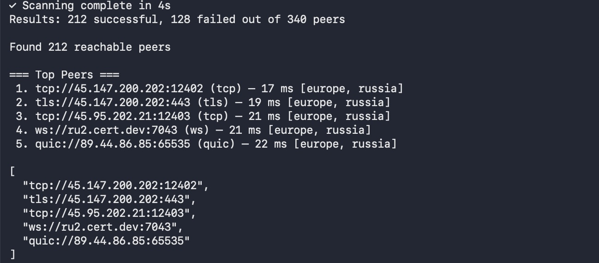
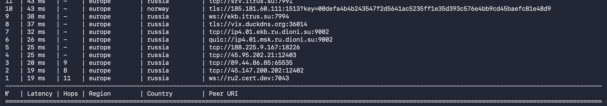
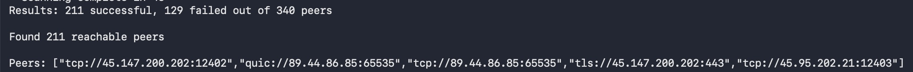

# PeerYgg

<p align="center">
  
</p>

<p align="center">
  <b>English</b> ·
  <a href="README.ru.md">Русский</a>
</p>

<p align="center">
  <a href="https://github.com/GenkaOk/PeerYgg/actions/workflows/build-release.yml"></a>
  <a href="LICENSE"></a>
</p>

**The utility for search nearest peers in Yggdrasil**

PeerYgg is a tool for discovering and analyzing Yggdrasil network peers with minimal latency.

The program automatically detects available peers and calculates the routing hops to each node, helping you select the
most efficient connections.

## Key Features

- **Latency measurement** — identify minimal latency to each peer
- **Routing analysis** — calculate hop count (traceroute) to target nodes
- **Flexible output formats** — export results as table, configuration file, or JSON for easy integration and analysis
- **Group results** — group peers by IP address for better organization and analysis


---

## Install

### Windows

Download <a href="https://github.com/GenkaOk/PeerYgg/releases/latest/download/peerygg-windows-amd64.exe">binary file</a>
and run in shell

#### PowerShell

```shell
curl -L -O https://github.com/GenkaOk/PeerYgg/releases/latest/download/peerygg-windows-amd64.exe

peerygg-windows-amd64
```

### macOS

#### Quick Run (Intel)

```sh
curl -LO https://github.com/GenkaOk/PeerYgg/releases/latest/download/peerygg-darwin-amd64
chmod +x peerygg-darwin-amd64
./peerygg-darwin-amd64
```

#### Quick Run (Apple Silicon)

```sh
curl -LO https://github.com/GenkaOk/PeerYgg/releases/latest/download/peerygg-darwin-arm64
chmod +x peerygg-darwin-arm64
./peerygg-darwin-arm64
```

### Linux

#### Quick Run (Linux AMD64)

```sh
curl -LO https://github.com/GenkaOk/PeerYgg/releases/latest/download/peerygg-linux-amd64
chmod +x peerygg-linux-amd64
./peerygg-linux-amd64
```

### From source

```sh
git clone https://github.com/GenkaOk/PeerYgg
cd PeerYgg
go build .
# binary is at ./PeerYgg
```

---

## Usage

### Supported OS

Utility supported next OS:

| System                    | File                                                                                                                          |
|---------------------------|-------------------------------------------------------------------------------------------------------------------------------|
| **Windows**               | <a href="https://github.com/GenkaOk/PeerYgg/releases/latest/download/peerygg-windows-amd64.exe">peerygg-windows-amd64.exe</a> |
| **Linux x64**             | <a href="https://github.com/GenkaOk/PeerYgg/releases/latest/download/peerygg-linux-amd64">peerygg-linux-amd64</a>             |
| **Linux ARM**             | <a href="https://github.com/GenkaOk/PeerYgg/releases/latest/download/peerygg-linux-arm64">peerygg-linux-arm64</a>             |
| **Linux MIPS**            | <a href="https://github.com/GenkaOk/PeerYgg/releases/latest/download/peerygg-linux-mips">peerygg-linux-mips</a>               |
| **Linux MIPSLE**          | <a href="https://github.com/GenkaOk/PeerYgg/releases/latest/download/peerygg-linux-mipsle">peerygg-linux-mipsle</a>           |
| **MacOS (Intel)**         | <a href="https://github.com/GenkaOk/PeerYgg/releases/latest/download/peerygg-darwin-amd64">peerygg-darwin-amd64</a>           |
| **MacOs (Apple Silicon)** | <a href="https://github.com/GenkaOk/PeerYgg/releases/latest/download/peerygg-darwin-arm64">peerygg-darwin-arm64</a>           |

### CLI mode

```bash
Usage of PeerYgg:
  -c int
    	concurrency for pings (default 30)
  -group
    	group peers by host and select best connection per server
  -insecure
    	allow skip SSL verification
  -n int
    	number of fastest peers/servers to output (default 5)
  -output string
    	output format: current|json|table|config (default "current")
  -progress string
    	progress mode: [n]one|[s]imple|[f]ull (default "full")
  -t int
    	timeout per ping in seconds (default 1)
  -trace-count int
    	tracing count peers to calculate hops, 0 for disable trace calculate (default 5)
  -trace-max-hops int
    	max hops count for calculate (default 20)
  -trace-timeout int
    	timeout in seconds for tracing all peers (default 30)
```

#### Output Formats

| Format  | Use Case                                                                       | Command                         | Screenshot                                                                      |
|---------|--------------------------------------------------------------------------------|---------------------------------|---------------------------------------------------------------------------------|
| Default | Default output                                                                 | `PeerYgg`                         | <a href="assets/example-default.jpg"></a> 
| Table   | Quick visual inspection of peer data in terminal                               | `PeerYgg -output table`           | <a href="assets/example-table.jpg"></a>     
| Config  | Output as Yggdrasil configuration files for integration with another CLI tools | `PeerYgg -output config`          | <a href="assets/example-config.jpg"></a>   
| JSON    | Programmatic access and integration with other tools                           | `PeerYgg -output json > out.json` | <a href="assets/example-json.jpg"></a>       

---

## License

MIT